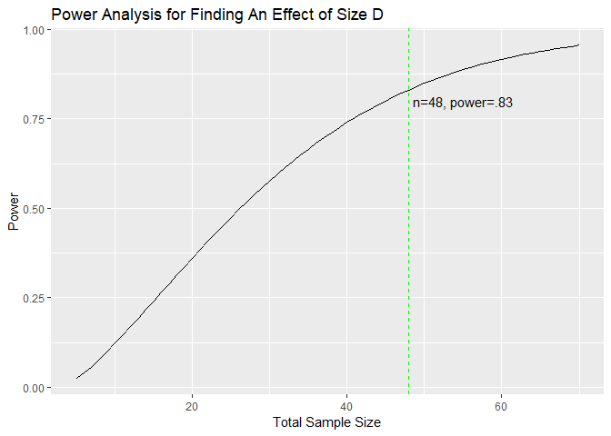
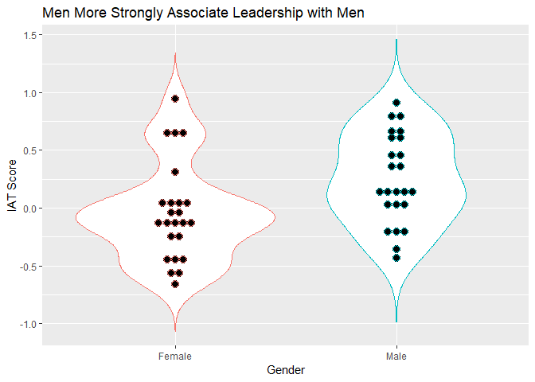
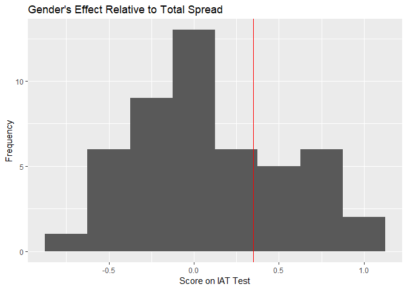
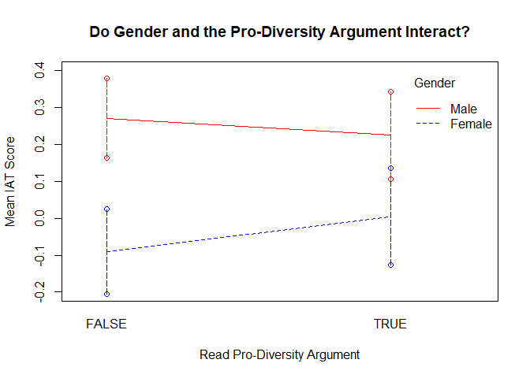
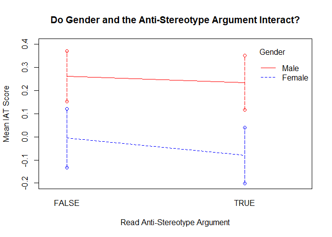
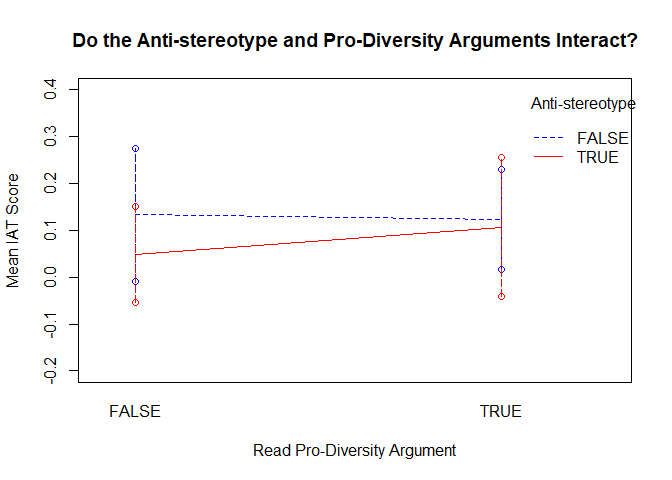
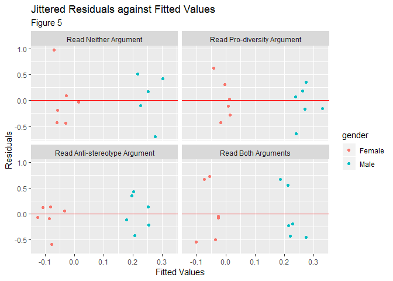
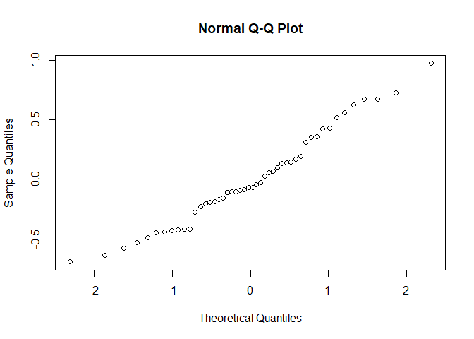
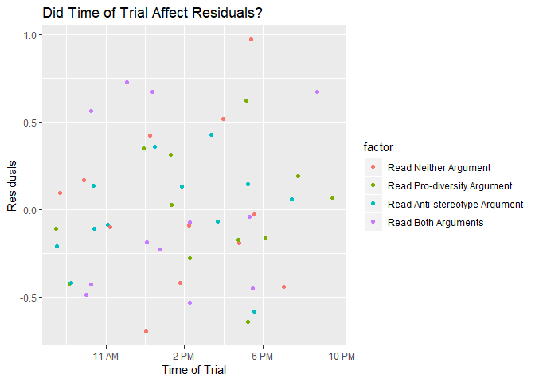
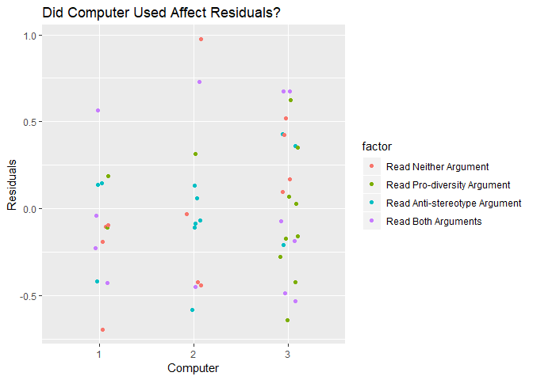

The Resiliency of Gendered Associations about Leadership
================

Write-up by Salim Damerdji. Experiment conducted by Salim Damerdji, Roberto Lievana, and Aditya Jhanwar in 2019.

Introduction
============

In the US, women hold far fewer elite leadership positions than men. As of 2019, women account for 23.7% of US congresspersons; women hold only 6.6% of Fortune 500 CEO roles; and all 45 presidents in American history have been men[1] [2].

Unsurprisingly, leadership is associated with masculine-coded traits, such as being tough and commanding[3]. This association itself makes it harder for women to succeed in leadership positions[4] [5].

We ran an experiment to test the resiliency of these gendered associations. We find evidence that people will associate leadership with men all the same even after reading arguments that advise the contrary.

Methodology
===========

For our study, we recruited 48 volunteers, all of whom were STEM undergraduate or graduate students at UC Berkeley. Of our 48 volunteers, we had 24 female participants and 24 male participants. We asked participants in the treatment groups to read an argument about women and leadership. Afterwards, each participant took an Implicit Association Test (IAT).

Treatment and Control Groups
----------------------------

Participants in the treatment groups read at least one of two arguments about women leadership.

Here is the pro-diversity argument: 'The University of California-Davis reported that the top 25 California companies with the highest percentage of women executives and board members saw a 74 percent higher return on assets and equity than the broader set of companies surveyed. This included companies such as William-Sonoma, Yahoo!, and Wells Fargo'[6].

Here is the anti-stereotype argument: 'We often think of leaders as dominant and ambitious-as embodying qualities that closely match the stereotype of men. On the other hand, the traits that make up the feminine stereotype (e.g., friendliness and sensitivity) are seen as less vital to leadership. These stereotypes result in women being evaluated less positively than men for leadership positions' [7][8].

We chose to study these two arguments because they are both archetypal: the pro-diversity argument is archetypal of a business-oriented argument that sells diversity as a route to organizational success; the second argument is, in contrast, archetypal of a social-justice-oriented argument that focuses on existing harmful stereotypes. We chose to study these arguments due to how common these types of arguments are.

Experimental subjects received one of four treatment combinations: prior to taking the IAT, the subject either read nothing, read only the pro-diversity argument, read only the anti-stereotype argument, or read both.

Participants in the control group read nothing prior to taking the IAT.

Blocking
--------

We thought it a good bet that women internalized stereotypes about women differently than men internalized those stereotypes. Blocking by gender converts this unplanned systematic variability into planned variability, reducing noise and increasing statistical power. In the results section, we show this strategy was well-advised.

Power Analysis
--------------

Prior to running our experiment, we looked for the smallest sample size n that yields a power of at least 0.8.

In our power analysis, we used .10 as an estimate for variance, per dry run data. We assumed error variance would be the same for both genders. Based on our dry run data, we thought a difference D = .1 would be the smallest IAT score differential that would be practically meaningful.

We also planned to conduct three statistical tests, and included controls for multiple testing into our power analysis. At a family-wise error rate of .05, the plot below shows the power curve for an alternative hypothesis that one condition of interest - whether it be gender, the pro-diversity argument, or the anti-stereotype argument - had an effect size of D.



With 48 subjects total, we expected our experiment to have .83 power. Put informally, we have an 83% chance of reporting a positive finding if there is, in fact, a practically significant effect to find.

Measurement
-----------

We use an Implicit Association Test (IAT) to measure how strongly a subject associates each gender with leadership. IATs offer an indirect measure of how strongly someone associates two concepts. Our IAT is an abridged modification of Harvard's IAT. This tool has been well-studied by a large literature base [9]. We use the IAT because, unlike self-reporting, IATs measure unconscious associations and biases that people would not admit to having.

To measure the response, we gave participants an abbreviated IAT that consisted of five stages. In each stage, the subject is asked to press 'e' for group of stimuli and press 'i' for another. They're described in the table below.

| Stage | Press 'e'                         | Press 'i'                           |
|:------|-----------------------------------|-------------------------------------|
| 1     | Male names                        | Female names                        |
| 2     | Types of leaders                  | Types of supporters                 |
| 3     | Male names OR types of leaders    | Female names OR types of supporters |
| 4     | Types of supporters               | Types of leaders                    |
| 5     | Male names OR types of supporters | Female names OR types of leaders    |

Our computer program tracks the delay between when a particular stimulus (e.g. when the name 'Joe') is displayed on the center of the screen, and when the subject presses the appropriate key on the keyboard (e.g. 'e'). This delay is measured in seconds, with precision up to the the tenth of a millisecond.

Our response of interest, the IAT score, is the mean reaction time for stage 3 minus the mean reaction time for stage 5, divided by the standard deviation of reaction times for those two stages [10]. The basic intuition is that if subjects have quicker reaction times for stage 3 than for stage 5, then it's easier for the subject to mentally associate male names with leadership stimuli than it is for them to associate female names with leadership stimuli. A large, positive IAT score indicates stronger implicit associations of men with leadership.

Validity
--------

#### Internal Validity

In virtue of being a concealed human attitude, implicit bias is difficult to study, so there are limitations to IAT scores. IAT scores are merely proxies for implicit bias. Although all measures of human attitudes are based on indirect measures - including self-reporting or behavior - it is fair to ask whether high IAT scores actually correlate with implicit bias.

A 2009 meta-study by Greenwald et al. found that, across 122 studies and 14,900 subjects, IAT scores positively correlated with "a wide range of criterion measures, from interracial friendliness and impression formation to anxious and shy behaviors, consumer choices, and voting," with an average pearson coefficient of .274 [11]. These findings held up across a wide array of IATs, including IATs that measure implicit gender bias.

A correlation coefficient of .274 is not high, but neither are correlation coefficients for other proxies for bias, including self-reporting (Greenwald et al. 2009). Moreover, IAT scores are more reliable than self-reporting for socially sensitive topics [12]. That's because IAT scores can capture implicit biases that subjects may be unconscious of or unwilling to report on a survey.

#### External Validity

Our results are limited in that they only measure the marginal effect of hearing the pro-diversity or anti-stereotype argument one time. It's entirely possible - indeed, likely - that our participants, UC Berkeley students, have heard arguments similar to the pro-diversity or anti-stereotype argument before. Thus, we are not able to study the effect of hearing these arguments for the first time.

Nevertheless, we believe it's still useful to study the marginal effect of these arguments. Given that arguments similar to the ones we study are fairly common, it's worth learning whether there are gains in gender diverse leadership to be made by repeating these arguments to those who have already heard them.

Second, UC Berkeley STEM students are not representative of the general population in America. That's not to say it's an uninteresting population: it's largely representative of the Silicon Valley tech force. Moreover, if our experiment is repeated for other subsets of the general population, a literature review could validate whether our findings generalize to the larger population.

Results
=======

Overview on Data
----------------

We present the means of each treatment/block combination below:

``` r
iat_df %>%
  dplyr::group_by(factor, gender) %>%
  summarise(mean_score = round(mean(iat_d), 2)) %>%
  rename(Treatment=factor)
```

    ## # A tibble: 8 x 3
    ## # Groups:   Treatment [4]
    ##   Treatment                     gender mean_score
    ##   <fct>                         <fct>       <dbl>
    ## 1 Read Neither Argument         Female      -0.03
    ## 2 Read Neither Argument         Male         0.3 
    ## 3 Read Pro-diversity Argument   Female       0.02
    ## 4 Read Pro-diversity Argument   Male         0.23
    ## 5 Read Anti-stereotype Argument Female      -0.15
    ## 6 Read Anti-stereotype Argument Male         0.24
    ## 7 Read Both Arguments           Female      -0.01
    ## 8 Read Both Arguments           Male         0.23

Model
-----

Our model is:

*y*<sub>*i**j**k**l*</sub> = *μ* + *α*<sub>*i*</sub> + *β*<sub>*j*</sub> + *γ*<sub>*k*</sub> + *ϵ*<sub>*i**j**k*</sub>

where *μ* is the baseline IAT score, *α*<sub>*i*</sub> is the effect of the *i*<sup>*t**h*</sup> level of the pro-diversity factor, \_{j} is the effect of the *j*<sup>*t**h*</sup> level of the anti-stereotype factor, *γ*<sub>*k*</sub> is the block effect, and *ϵ*<sub>*i**j**k*</sub> is the experimental error. We assume the *ϵ*<sub>*i**j**k*</sub> ~ N (0,2).

``` r
mod <- aov(iat_d ~ prodiversity + antistereotype + gender, data = iat_df)
summary(mod)
```

    ##                Df Sum Sq Mean Sq F value Pr(>F)  
    ## prodiversity    1  0.007  0.0072   0.042 0.8379  
    ## antistereotype  1  0.031  0.0315   0.186 0.6684  
    ## gender          1  1.019  1.0191   6.026 0.0181 *
    ## Residuals      44  7.442  0.1691                 
    ## ---
    ## Signif. codes:  0 '***' 0.001 '**' 0.01 '*' 0.05 '.' 0.1 ' ' 1

Gender has a somewhat statistically significant effect. We use a Bonferroni correction for multiple-testing. We find gender has an effect that is statistically significant at a .10 Family-Wise Error Rate (FWER), but not at a .05 FWER. (A Family-Wise Error Rate is the probability of making a Type-I error across *any* of our four tests.) The split along gender is plotted below.

``` r
ggplot(iat_df, aes(x=gender, y=iat_d, color=gender)) +
  geom_violin(trim=F, show.legend=F) +
  ggtitle('Men More Strongly Associate Leadership with Men') +
  xlab('Gender') +
  ylab('IAT Score') +
  geom_dotplot(binaxis='y', stackdir='center', binwidth=.07, show.legend=F)
```



This suggests it was a good choice to block by gender: we would have had a less powerful experiment if we didn't plan for this systematic variance.

We estimate that being male increases one's IAT score by:

    ## genderMale 
    ##       0.29

This is practically significant. Recall that a larger, positive score indicates a stronger association of leadership with men. Below, the empirical distribution of IAT scores is displayed as a histogram. A red line indicates a +.30 effect of gender added to the median.

``` r
mid <- median(iat_df$iat_d)
ggplot(iat_df) +
  geom_histogram(aes(iat_d), binwidth=.25) +
  geom_vline(aes(xintercept=mid+.3), color='red') +
  xlab('Score on IAT Test') +
  ylab('Frequency') +
  ggtitle("Gender's Effect Relative to Total Spread")
```



A .30 effect from gender leads to a large offset relative to the total spread of IAT scores seen.

The other conditions of interest had no statistically significant effect on IAT scores.

Model Assumptions
-----------------

### Additivity vs Interaction

The model above assumes there are additive effects. In other words, the model does not have terms explicitly capturing interactions between two treatments.



There's no clear evidence of an interaction effect. If there was an interaction effect, we'd expect to see line segments with very different slopes. But the line segments above are close to parallel. As the standard error bars indicate, natural variability in sampling can completely explain away any apparent differences of the effect of one factor given another. Thus, it's fair to make assume these treatment effecs are additive.

### Errors

We also have to verify the errors are homoscedastic, normally distributed, and iid. The plots below suggest the errors are homoscedastic because the variances of the residuals are roughly constant even within the most granular subgroups.



Using a normal Q-Q Plot, we can see the residuals are distributed fairly normally. A perfectly normal distribution would be plotted as a straight line, and our distribution is quite close to that:

``` r
qqnorm(fit_resid$r)
```



To check that errors are independent, I considered whether the time at which a subject took the IAT lead to some correlation amongst subsets of the residuals.



There are no glaring signs of serial dependence, but the three observations on the far right do have large, positive residuals. There are a few reasons to think this is not a serious issue.

First, this apparent trend may be due to natural variability in the data: three data points may be suggestive, but are hardly conclusive. Furthermore, randomization protects against this variability by converting systematic unplanned variability into chance-like variability. As a result, if there is some weak serial dependence, it only marginally decreases power; it does not risk the validity of positive findings made. Finally, ANOVA inferences are fairly reliable 'when the departures from our assumptions are not too large' [13]. That seems to be the case here.

I also checked another potential issue for the independent errors assumption. The IAT was administered as a computer program on one of three computers. It's plausible the computer used had some systematic effect on the errors, so I checked for this in the residuals.



Based on the graph above, it does not seem that the computer on which participants took the test affected the residuals.

Thus, all ANOVA assumptions hold to a reasonable degree for this dataset.

Conclusions
-----------

We found some evidence that compared to women, men more strongly associate leadership with men. Moreover, there is a practically significant difference between the average man's association and the average woman's association of gender and leadership. Because this is a blocking effect, we cannot make any causal claim that the male gender per se causes this association. But the experiment does suggest that this correlation exists.

We found no evidence that either the pro-diversity or anti-stereotype arguments had an effect on a reader's implicit association of men with leadership. This suggests that stereotypes regarding gender and leadership are resilient, at least with respect to two common arguments against them.

References
==========

[1] Mejia, Zameena. Just 24 Female CEOs Lead the Companies on the 2018 Fortune 500-Fewer than Last Year. CNBC, 21 May 2018, www.cnbc.com/2018/05/21/2018s-fortune-500-companies-have-just-24-female-ceos.html.

[2] DeSilver, Drew. "A Record Number of Women Will Be Serving in the New Congress." Pew Research Center, Pew Research Center, 18 Dec. 2018, www.pewresearch.org/fact-tank/2018/12/18/record-number-women-in-congress/.

[3] Zheng, Wei, et al. "How Women Manage the Gendered Norms of Leadership." Harvard Business Review, 28 Nov. 2018, hbr.org/2018/11/how-women-manage-the-gendered-norms-of-leadership.

[4] Zheng, Wei, et al. "How Women Manage the Gendered Norms of Leadership." Harvard Business Review, 28 Nov. 2018, hbr.org/2018/11/how-women-manage-the-gendered-norms-of-leadership.

[5] Eagly, Alice H., et al. "Gender and the Effectiveness of Leaders: A Meta-Analysis." Psychological Bulletin, vol. 117, no. 1, 1 Jan. 1995, pp. 125-145., <doi:10.1037//0033-2909.117.1.125>.

[6] Lemke, Tim. "Do Companies With Female Executives Perform Better?" The Balance, The Balance, 1 Feb. 2019, www.thebalance.com/do-companies-with-female-executives-perform-better-4586443.

[7] Prime, Jeanine. Women "Take Care," Men "Take Charge." Edited by Andrea Juncos and Kara Patterson, Catalyst, 2005, pp. 1-38, Women "Take Care," Men "Take Charge."

[8] Although neither argument *explicitly* says that diversity is good or stereotypes are bad, it's convienent to use these descriptions as shorthand.

[9] A Google Scholar search yields over 26,500 results for articles containing the exact wording: 'implicit association test.'

[10] We divide the difference by the pooled standard deviation because the "magnitudes of differences between experimental treatment means are often correlated with variability of the data from which the means are computed" (Greenwald, et. al 2003). In our dataset, we found a large association of r = .54 between these the magnitude of differences and the variability of a person's reaction times. By dividing by the pooled standard deviation, IAT scores more closely track the signal of implicit associations, rather than the noise of variability in response times.

[11] Greenwald, Anthony G, et al. "Understanding and Using the Implicit Association Test: III. Meta-Analysis of Predictive Validity." PsycEXTRA Dataset, 2007, <doi:10.1037/e633982013-155>.

[12] Greenwald, Anthony G, et al. "Understanding and Using the Implicit Association Test: III. Meta-Analysis of Predictive Validity." PsycEXTRA Dataset, 2007, <doi:10.1037/e633982013-155>.

[13] Oehlert, Gary W. A First Course in Design and Analysis of Experiments. Freeman, 2000.
